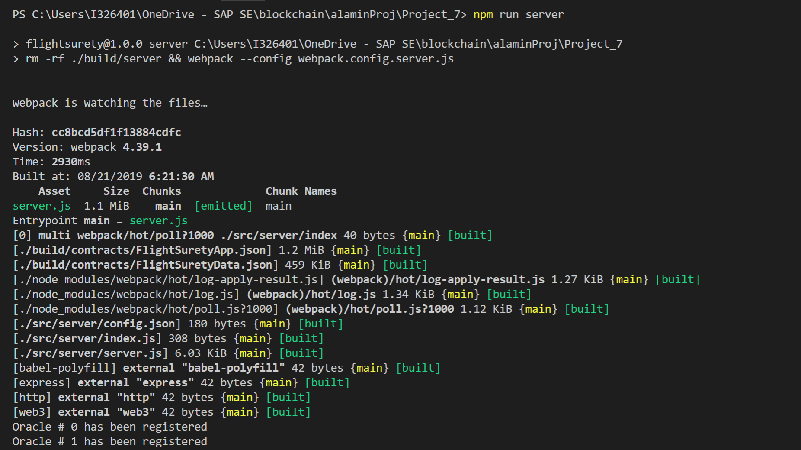
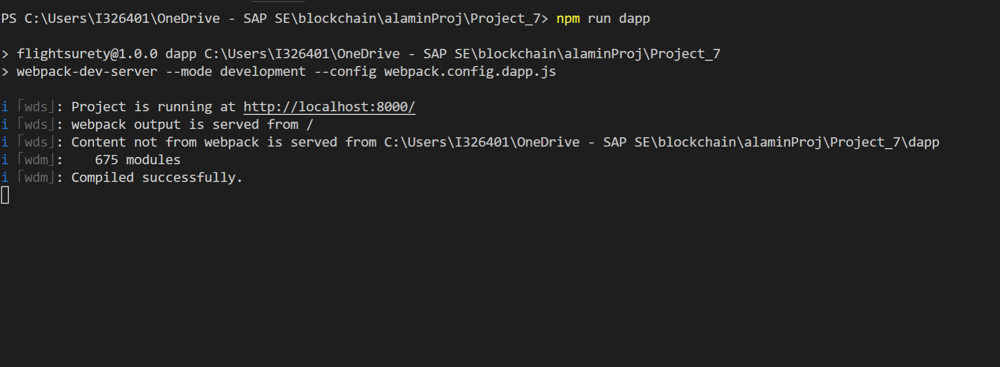
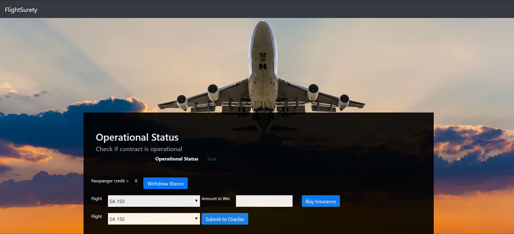
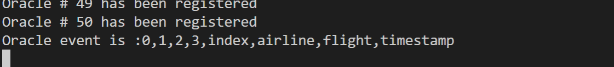
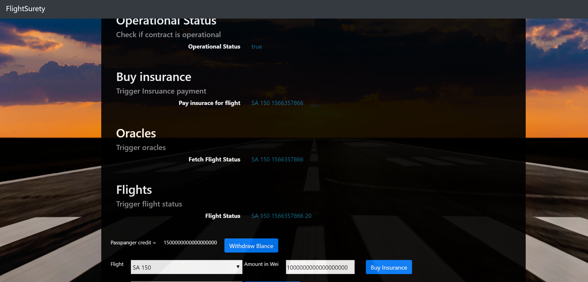
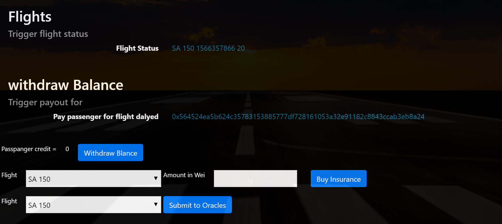

# FlightSurety

FlightSurety is a sample application project for Udacity's Blockchain course.

## requirement to run project wihtout error
In Ganache make sure you have min of 100 accounts.
In Ganache set GAS PRICE to 20000000000 and GAS LIMIT to 9999999

## Install

This repository contains Smart Contract code in Solidity (using Truffle), tests (also using Truffle), dApp scaffolding (using HTML, CSS and JS) and server app scaffolding.

To install, download or clone the repo, then:

`npm install`
`truffle compile`

## Develop Client

To run truffle tests:

`truffle test ./test/flightSurety.js`
`truffle test ./test/oracles.js`

To use the dapp:

`truffle migrate --reset --compile-all`
`npm run dapp`

To view dapp:

`http://localhost:8000`

## Develop Server

`npm run server`

## Deploy

To build dapp for prod:
`npm run dapp:prod`

Deploy the contents of the ./dapp folder

## Resources

* [How does Ethereum work anyway?](https://medium.com/@preethikasireddy/how-does-ethereum-work-anyway-22d1df506369)
* [BIP39 Mnemonic Generator](https://iancoleman.io/bip39/)
* [Truffle Framework](http://truffleframework.com/)
* [Ganache Local Blockchain](http://truffleframework.com/ganache/)
* [Remix Solidity IDE](https://remix.ethereum.org/)
* [Solidity Language Reference](http://solidity.readthedocs.io/en/v0.4.24/)
* [Ethereum Blockchain Explorer](https://etherscan.io/)
* [Web3Js Reference](https://github.com/ethereum/wiki/wiki/JavaScript-API)

## Steps to run the smart contract, dapp and server  

